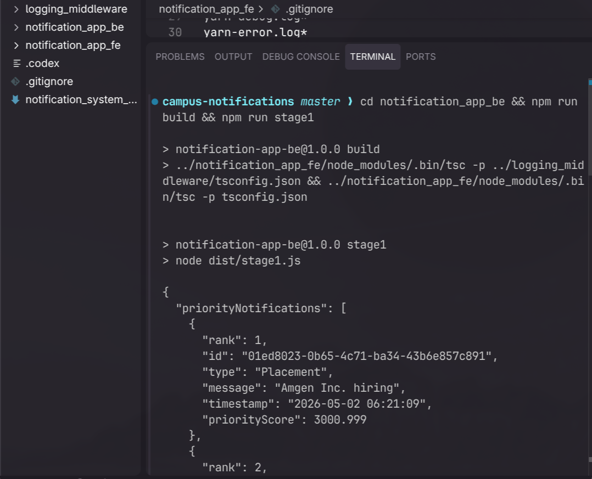
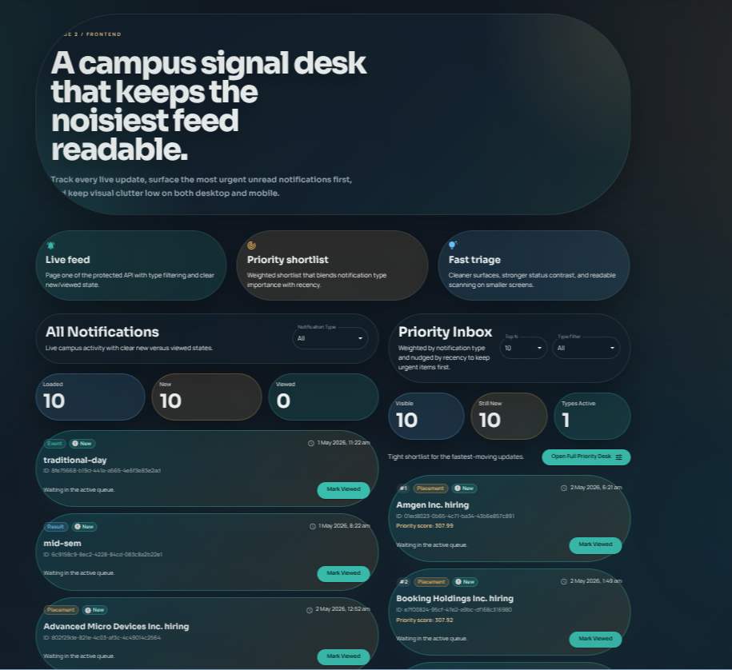

# Campus Notification System

A full-stack notification management system designed for campus environments, featuring priority-based notification ranking, real-time updates, and comprehensive logging.

## 📸 Screenshots

### Dashboard View

*Main dashboard showing all notifications with filtering and search capabilities*

### Priority Notifications

*Priority inbox displaying top-ranked notifications based on type and recency*

## 🏗️ Architecture

This monorepo contains three main packages:

```
campus-notifications/
├── logging_middleware/     # Reusable logging package
├── notification_app_be/    # Backend API and Stage 1 implementation
├── notification_app_fe/    # Next.js frontend application
└── notification_system_design.md
```

### Components

#### 1. **Logging Middleware** (`logging_middleware/`)
A reusable TypeScript logging package that provides structured logging with:
- Stack-aware logging (frontend/backend)
- Package-level categorization (api, service, config, utils)
- Multiple log levels (debug, info, error)
- Consistent formatting across the application

#### 2. **Backend** (`notification_app_be/`)
Node.js backend implementing Stage 1 requirements:
- Protected API authentication
- Paginated notification fetching
- Priority-based ranking algorithm
- Efficient top-N selection using min-heap
- Comprehensive logging integration

#### 3. **Frontend** (`notification_app_fe/`)
Next.js 16 application with Material-UI:
- Dashboard with all notifications
- Priority inbox view
- Real-time notification updates
- Search and filter capabilities
- Responsive design with Tailwind CSS

## 🎯 Key Features

### Priority Ranking Algorithm

Notifications are ranked using a sophisticated scoring system:

```
priorityScore = (typeWeight × 1000) + recencyBonus
```

**Type Weights:**
- 🎓 **Placement**: 3 (highest priority)
- 📊 **Result**: 2 (medium priority)
- 📅 **Event**: 1 (standard priority)

The algorithm ensures:
- Placements always appear before Results
- Results always appear before Events
- Within each category, newer notifications rank higher

### Efficient Top-N Selection

Uses a bounded min-heap for O(m log n) complexity:
- Maintains only the top N notifications in memory
- Efficient for streaming/paginated data
- Scales well with large notification volumes

## 🚀 Getting Started

### Prerequisites

- Node.js 20+ and npm
- Environment variables for evaluation API access

### Installation

1. **Clone the repository**
   ```bash
   git clone <repository-url>
   cd campus-notifications
   ```

2. **Install dependencies**
   ```bash
   # Install frontend dependencies (includes all packages)
   cd notification_app_fe
   npm install
   ```

3. **Build the logging middleware**
   ```bash
   cd ../logging_middleware
   npm run build
   ```

### Running the Backend (Stage 1)

1. **Configure environment variables**
   
   Create `notification_app_be/.env`:
   ```env
   # Option 1: Use direct bearer token
   EVALUATION_ACCESS_TOKEN=your_token_here
   
   # Option 2: Use authentication credentials
   EVALUATION_EMAIL=your_email
   EVALUATION_NAME=your_name
   EVALUATION_ROLL_NO=your_roll_number
   EVALUATION_ACCESS_CODE=your_access_code
   EVALUATION_CLIENT_ID=your_client_id
   EVALUATION_CLIENT_SECRET=your_client_secret
   ```

2. **Build and run**
   ```bash
   cd notification_app_be
   npm run build
   npm run stage1 -- --topN 10 --pageSize 100 --maxPages 5
   ```

3. **Optional: Filter viewed notifications**
   ```bash
   npm run stage1 -- --topN 10 --viewedIds ./viewed-notification-ids.json
   ```

### Running the Frontend

1. **Configure environment variables**
   
   Create `notification_app_fe/.env.local`:
   ```env
   EVALUATION_ACCESS_TOKEN=your_token_here
   # Or use the full credential set
   ```

2. **Start the development server**
   ```bash
   cd notification_app_fe
   npm run dev
   ```

3. **Open in browser**
   ```
   http://localhost:3000
   ```

## 📁 Project Structure

### Backend Structure
```
notification_app_be/
├── src/
│   └── stage1.ts          # Main entry point for Stage 1
├── dist/                  # Compiled JavaScript output
├── package.json
└── tsconfig.json
```

### Frontend Structure
```
notification_app_fe/
├── app/
│   ├── api/              # Next.js API routes
│   │   ├── logs/         # Logging endpoint
│   │   ├── notifications/ # Notifications API
│   │   └── priority/     # Priority notifications
│   ├── priority/         # Priority page
│   ├── layout.tsx
│   └── page.tsx          # Dashboard page
├── src/
│   ├── components/       # React components
│   ├── lib/
│   │   ├── client/       # Client-side utilities
│   │   ├── server/       # Server-side utilities
│   │   └── shared/       # Shared utilities
│   └── types/            # TypeScript type definitions
└── public/               # Static assets
```

### Logging Middleware Structure
```
logging_middleware/
├── src/
│   └── index.ts          # Logger implementation
├── dist/                 # Compiled output
└── package.json
```

## 🔧 Technology Stack

### Backend
- **Runtime**: Node.js with ES Modules
- **Language**: TypeScript 5
- **Build**: TypeScript Compiler (tsc)

### Frontend
- **Framework**: Next.js 16.2.4 (App Router)
- **UI Library**: Material-UI (MUI) 9.0.0
- **Styling**: Tailwind CSS 4 + Emotion
- **Language**: TypeScript 5
- **React**: 19.2.4

### Shared
- **Logging**: Custom logging middleware
- **Package Manager**: npm with local workspace linking

## 📊 API Endpoints

### Frontend API Routes

#### `GET /api/notifications`
Fetch all notifications with pagination
- Query params: `page`, `pageSize`, `maxPages`
- Returns: Array of notifications

#### `GET /api/priority`
Fetch top-N priority notifications
- Query params: `topN`, `pageSize`, `maxPages`
- Returns: Ranked array of priority notifications

#### `POST /api/logs`
Submit client-side logs
- Body: Log entry with stack, package, level, message
- Returns: Success confirmation

## 🧪 Development

### Build Commands

```bash
# Build logging middleware
cd logging_middleware && npm run build

# Build backend
cd notification_app_be && npm run build

# Build frontend
cd notification_app_fe && npm run build
```

### Linting

```bash
cd notification_app_fe
npm run lint
```

## 📝 Design Documentation

For detailed system design, architecture decisions, and implementation details, see:
- [Notification System Design](./notification_system_design.md)

## 🔐 Security Notes

- Never commit `.env` files to version control
- Use `.env.example` as a template for required variables
- Store sensitive credentials securely
- The `.gitignore` is configured to exclude all environment files

## 📄 License

Private project - All rights reserved

## 👥 Contributing

This is an evaluation project. For questions or issues, contact the development team.

---

**Built with for campus notification management**
